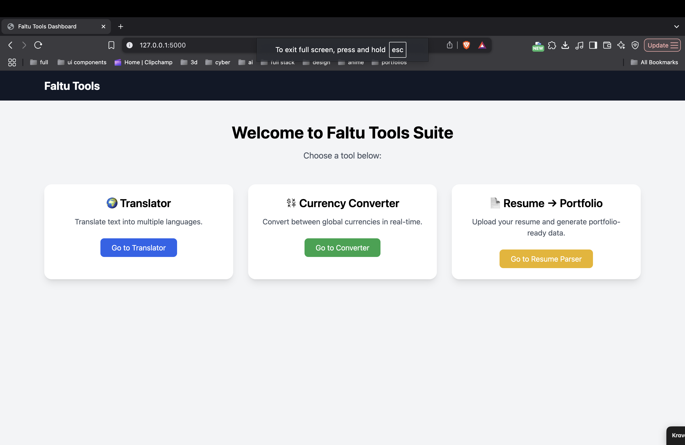
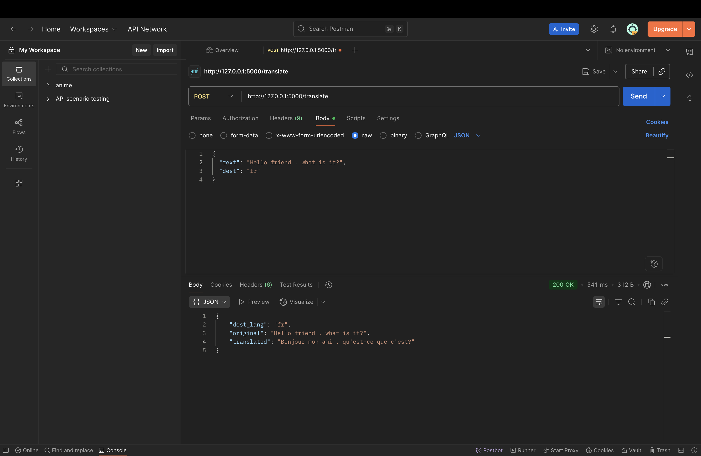
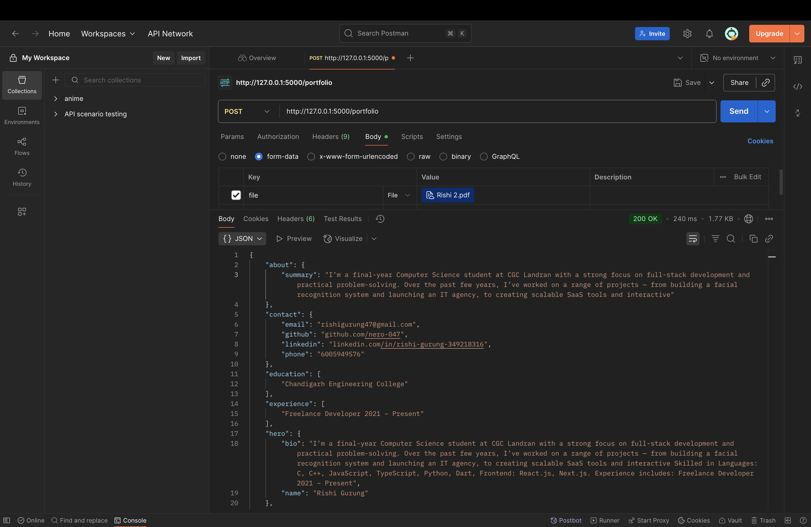

## A lightweight Flask-based API hub that provides three core utilities:

- 🌍 **Translator** – Translate text into different languages  
- 💱 **Currency Converter** – Convert amounts between currencies  
- 📄 **Resume → Portfolio** – Extract structured info from a resume  

---

## 🎥 Demo
[](uploads/vid0.mp4)

---

## 🚀 Features
- RESTful API with Flask  
- JSON-based input/output for APIs  
- File upload support for resume parsing  
- Postman collection for easy testing  
- Frontend templates (basic UI)  

---

## 📂 Project Structure
```text
mini-assign/
├── app.py                     # Flask entry point
├── services/                  # Core business logic
│   ├── translator.py
│   ├── currency.py
│   └── portfolio.py
├── templates/                 # Basic HTML UIs
├── uploads/                   # Uploaded resumes
├── requirements.txt           # Dependencies
└── mini-assign.postman_collection.json # Postman tests
```

---

## ⚡ Setup & Installation

### 1. Clone the repo
```bash
git clone https://github.com/nero-047/mini-assign.git
cd mini-assign
```

### 2. Create a virtual environment
```bash
python -m venv venv
source venv/bin/activate   # Mac/Linux
venv\Scripts\activate      # Windows
```

### 3. Install dependencies
```bash
pip install -r requirements.txt
```

### 4. Run the server
```bash
python app.py
```
Server will start at: http://127.0.0.1:5000/

---

## 📡 API Endpoints

### 🔤 Translator
POST /translate
```json
{
  "text": "Hello World",
  "dest": "fr"
}
```
✅ Response:
```json
{
  "translated_text": "Bonjour le monde",
  "source": "en",
  "dest": "fr"
}
```

### 💱 Currency Converter
POST /currency
```json
{
  "amount": 100,
  "from": "USD",
  "to": "INR"
}
```
✅ Response:
```json
{
  "from": "USD",
  "to": "INR",
  "amount": 100,
  "converted_amount": 8799.6
}
```

### 📄 Resume → Portfolio

POST /portfolio
-	Type: form-data
-	Key: file → Upload .docx or .pdf resume

✅ Response:
```json
{
  "name": "John Doe",
  "email": "john@example.com",
  "skills": ["Python", "Flask", "AI"],
  "experience": [...]
}
```

## 🧪 API Testing (Postman)

1.	Import mini-assign.postman_collection.json into Postman
2.	Test each endpoint with sample requests
3.	✅ Example screenshots:

Translator API: 



Currency API:


Portfolio API:


